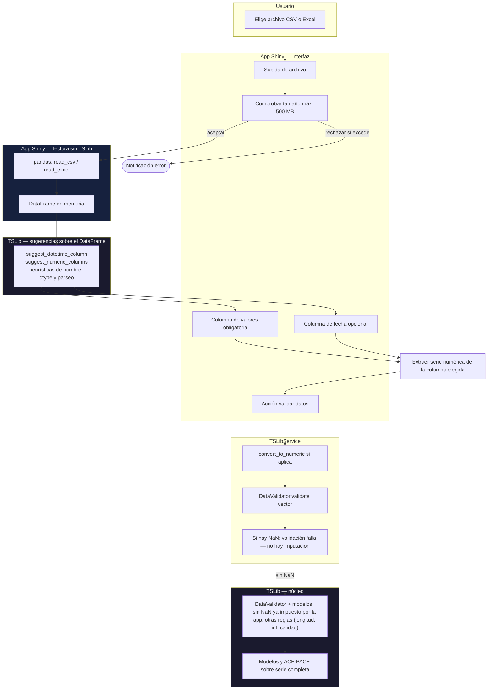

# Documentación: Ingesta de datos

En esta carpeta, `**PROCESO.txt**` resume en viñetas la política operativa. Aquí los **diagramas** van primero; debajo, **referencias** sobre el umbral del validador. **La app no imputa valores faltantes:** si hay cualquier NaN en la columna de valores, la validación falla y no se continúa.

Importar en [diagrams.net](https://app.diagrams.net/): **Insertar → Avanzado → Mermaid**.

---

## Diagrama 1 — Flujo de extremo a extremo

**Nota.** TSLib no abre archivos: la app lee el archivo; TSLib solo sugiere columnas y valida el vector extraído. El tope de **500 MB** se aplica en la app antes de `read_`*.

---

## Diagrama 2 — Política de faltantes (sin imputación en la app)

**Corrección lógica:** en el asistente Shiny no existe una secuencia «primero sin NaN y luego el validador decide si hay más del 10 %». Si **no** hay NaN, la proporción de faltantes es **0 %** por definición; el umbral del **10 %** no actúa como segunda puerta en ese camino. El flujo real es: (1) la app fuerza **rechazo con cualquier NaN**; (2) con **cero NaN**, `DataValidator.validate` sigue pudiendo rechazar por **otras** reglas (longitud, infinitos, calidad, etc.). El **10 %** sigue definido en TSLib para **política de faltantes en la librería** (p. ej. scripts que llaman al validador sin el corte estricto de la app) y para mensajes del validador cuando aún hubiera faltantes en otros contextos.

| Situación | Comportamiento en la app |
|-----------|---------------------------|
| **≥ 1 NaN** en la columna de valores (tras conversión numérica) | **No válida** siempre: mensaje explícito; no exploración ni modelado. |
| **0 NaN** y `DataValidator` devuelve `is_valid` | Se continúa. |
| **0 NaN** y `DataValidator` devuelve `is_valid = false` | No válida por otras reglas (p. ej. longitud mínima, infinitos). |
| **> 10 % NaN** (solo TSLib / pipelines sin corte app) | Regla del validador en librería; **en esta app** nunca se llega aquí con NaN porque el chequeo anterior ya rechazó. |

---

## Avisos del motor al validar

Tras pulsar **Validar datos**, la app registra advertencias de Python (`warnings`) emitidas durante `validate_data` y `get_exploratory_analysis`. Se guardan en `validation_report.runtime_warnings` y se muestran bajo **Avisos del motor (Python / librerías)** en la misma pantalla, además de seguir registrándose en la consola del servidor.

---

## Referencias y criterio del 10 %

Little y Rubin (*Statistical Analysis with Missing Data*, 3.ª ed., Wiley, 2019) insisten en que la inferencia con datos faltantes depende del **mecanismo** (MCAR, MAR, MNAR) y del modelo, no de un porcentaje universal. No existe un corte válido para todos los contextos.

En la práctica aplicada, muchas guías usan un **tamiz** cualitativo: faltantes **moderados por serie** suelen tratarse con métodos sencillos cuando la ausencia no es claramente informativa; por encima de proporciones altas conviene análisis de sensibilidad y métodos más fuertes. Este proyecto adopta **10 %** como valor por defecto (`DEFAULT_MAX_MISSING_RATIO`), alineado con esa práctica habitual y con el código existente, **sin** sustituir el juicio sobre por qué faltan datos.

## Preprocesado externo

Si la serie tiene huecos, el usuario debe **completarla fuera de la app** (hoja de cálculo, ETL, R/Python) según criterio de negocio. Referencias generales sobre imputación en series: Moritz y Bartz-Beielstein (2017), *The R Journal*, imputeTS; Hyndman y col., paquete **forecast** / `na.interp`.

---

*Código: `tslib.preprocessing.constants`, `column_suggestions`; app: `config_limits.py`, `TSLibService`, `app.py`. Datasets de prueba completos: carpeta `sampler/` en la raíz del proyecto TT.*