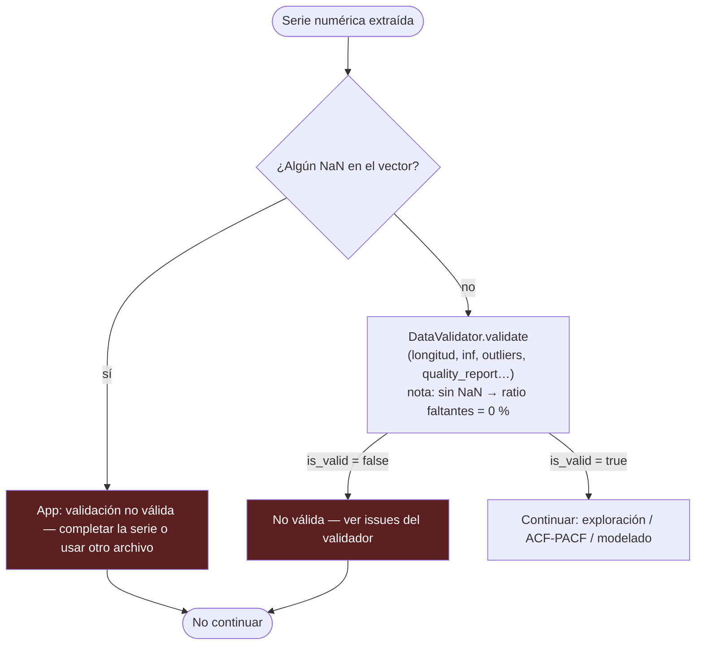

# Documentación: Ingesta de datos

En esta carpeta, `**PROCESO.txt**` resume en viñetas la política operativa. Aquí los **diagramas** van primero; debajo, **referencias** sobre el umbral del validador. **Política de la app:** la serie de la columna de valores debe estar **completa** (sin NaN) para avanzar; la validación marca fallo hasta que el usuario complete o sustituya los datos.

Importar en [diagrams.net](https://app.diagrams.net/): **Insertar → Avanzado → Mermaid**.

---

## Diagrama 1 — Flujo de extremo a extremo

**Nota.** La **app** lee el archivo (pandas); **TSLib** sugiere columnas sobre el `DataFrame` y valida el vector extraído. El tope de **500 MB** se aplica en la app antes de `read_`*.

---

## Diagrama 2 — Política de faltantes y validación TSLib

**Flujo en el asistente:** (1) se extrae el vector numérico y la app **exige cero NaN** para seguir; con datos completos, la proporción de faltantes vista por el validador es **0 %**. (2) Con ese vector, **`DataValidator.validate`** aplica longitud mínima, infinitos, métricas de calidad y, en **otros usos de TSLib**, el tamiz del **10 %** sobre vectores que aún pueden incluir NaN (p. ej. scripts). En el asistente, tras (1) el validador recibe un vector **completo** y evalúa **reglas de calidad y reglas duras** además del recuento de faltantes (que aquí queda en 0 %).

| Situación | Comportamiento en la app |
|-----------|---------------------------|
| **≥ 1 NaN** en la columna de valores (tras conversión numérica) | Validación **bloqueada**: mensaje para completar la serie; exploración y modelado **cuando** el vector quede completo. |
| **0 NaN** y `DataValidator` devuelve `is_valid` | Flujo **habilitado** (exploración y modelado). |
| **0 NaN** y `DataValidator` devuelve `is_valid = false` | Validación **bloqueada** por reglas duras (p. ej. longitud mínima, infinitos). |
| **> 10 % NaN** (validador TSLib en otros contextos) | El validador marca inválido si supera `DEFAULT_MAX_MISSING_RATIO`; **en el asistente**, la columna ya entra sin NaN, así que esta rama aplica sobre todo a **scripts y librería** fuera de la UI. |

---

## Qué muestra la pantalla al validar

Tras pulsar **Validar datos**, la interfaz **muestra** los **mensajes de reglas duras** traducidos desde `issues` del `DataValidator` (y el mensaje explícito de la app si aún hubiera NaN). Si las librerías emiten avisos durante la validación o el análisis exploratorio, aparecen bajo **Avisos del motor (Python / librerías)** (`validation_report.runtime_warnings`). En paralelo, **`quality_report`** guarda el informe completo del validador (diagnósticos de tendencia, outliers, recomendaciones) para **usos internos** — por ejemplo, decidir el bloqueo de AR/MA/ARMA ante señal de tendencia. La **salida visible** en este paso se apoya en **`issues`** y **`runtime_warnings`**; el resto del informe viaja en estado para el resto de la app.

---

## Referencias y criterio del 10 %

Little y Rubin (*Statistical Analysis with Missing Data*, 3.ª ed., Wiley, 2019) enfatizan que la inferencia con datos faltantes depende del **mecanismo** (MCAR, MAR, MNAR) y del modelo, más que de un porcentaje fijo universal.

En la práctica aplicada, muchas guías usan un **tamiz** cualitativo: faltantes **moderados por serie** suelen tratarse con métodos sencillos cuando la ausencia no es claramente informativa; por encima de proporciones altas conviene análisis de sensibilidad y métodos más fuertes. Este proyecto adopta **10 %** como valor por defecto (`DEFAULT_MAX_MISSING_RATIO`), alineado con esa práctica habitual y con el código existente, como **referencia operativa** junto al criterio de dominio sobre por qué faltan datos.

## Preprocesado externo

Si la serie tiene huecos, el usuario debe **completarla fuera de la app** (hoja de cálculo, ETL, R/Python) según criterio de negocio. Referencias generales sobre imputación en series: Moritz y Bartz-Beielstein (2017), *The R Journal*, imputeTS; Hyndman y col., paquete **forecast** / `na.interp`.

---

*Código: `tslib.preprocessing.constants`, `column_suggestions`; app: `config_limits.py`, `TSLibService`, `app.py`. Datasets de prueba completos: carpeta `sampler/` en la raíz del proyecto TT.*