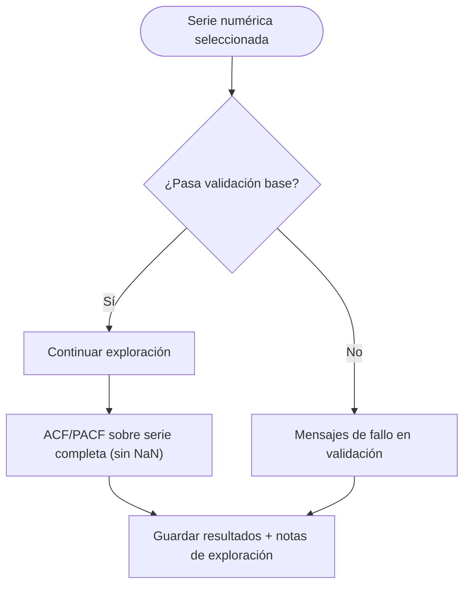

# Documentación: Exploración de datos

Este paso **toma la serie ya validada** en carga (validación automática al fijar columnas), calcula estadísticas básicas y genera señales exploratorias (ACF/PACF y diagnósticos heurísticos del validador en `quality_report`) antes del modelado.

En el flujo del asistente la columna de valores llega **completa** para continuar; el `DataValidator` sigue registrando longitud, infinitos y métricas de calidad. La app **modela sobre la serie tal cual** llega tras la validación (sin rellenar huecos en este paso).

Importar en [diagrams.net](https://app.diagrams.net/): **Insertar → Avanzado → Mermaid**.

---

## Diagrama 1 — Flujo del Paso 2

```mermaid
flowchart TB
  subgraph UI["Paso 2 — Exploración"]
    A[Usuario llega con Siguiente desde carga]
    B[Mostrar estado de validación, avisos del motor si hay]
    C[Mostrar serie temporal]
    D[Mostrar estadísticas básicas]
    E[Mostrar ACF y PACF]
    F[Mostrar notas de exploración]
  end

  subgraph APP["App Shiny"]
    G[auto_validate_on_column_inputs / _run_auto_validate_and_maybe_advance (paso 0)]
    H[TSLibService.validate_data]
    I[TSLibService.get_exploratory_analysis]
    J[Actualizar app_state: validation_report y exploratory_analysis]
  end

  subgraph TSLIB["TSLib"]
    K[DataValidator: longitud, NaN, inf, outliers, tendencia, estacionalidad]
    L[ACFCalculator / PACFCalculator]
  end

  G --> H
  H --> K
  H --> I
  I --> L
  I --> J
  J --> B
  J --> C
  J --> D
  J --> E
  J --> F
  A --> B

  style TSLIB fill:#1a1a2e,color:#eee
  style APP fill:#16213e,color:#eee
```

---

## Diagrama 2 — Decisiones en validación y exploración



---

## Qué se muestra en pantalla

- **Estado de validación**: mensajes de reglas duras en español; avisos del motor si las librerías los emiten.
- **Serie temporal**: gráfica principal para inspección visual.
- **Estadísticas**: media, desviación, mínimo y máximo.
- **ACF/PACF**: evidencia de dependencia temporal por rezagos.
- **Notas de exploración**: indicación breve que orienta a interpretar la estructura a partir de la **serie**, **ACF/PACF** y **estadísticas**.

---

## Áreas de mejora identificadas

- Añadir selector avanzado para **max_lag** en ACF/PACF.
- Separar en UI los avisos de tipo: dato vs modelo para mejorar trazabilidad.
- Mostrar de forma opcional resúmenes de diagnósticos (`quality_report.diagnostics`) sin presentarlos como tabla de «puntuación» única.
