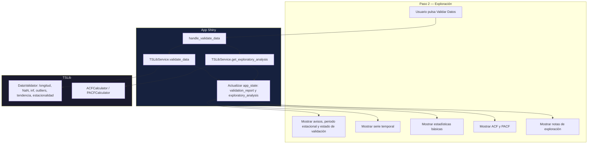

# Documentación: Exploración de datos

Este paso valida la serie elegida, calcula estadísticas básicas y genera señales exploratorias (ACF/PACF, tendencia, estacionalidad) antes del modelado.

Importar en [diagrams.net](https://app.diagrams.net/): **Insertar → Avanzado → Mermaid**.

---

## Diagrama 1 — Flujo del Paso 2

---

## Diagrama 2 — Decisiones en validación y exploración

---

## Qué se muestra en pantalla

- **Estado de validación**: mensajes y advertencias en español, incluyendo periodos estacionales candidatos cuando se detectan.
- **Serie temporal**: gráfica principal para inspección visual.
- **Estadísticas**: media, desviación, mínimo y máximo.
- **ACF/PACF**: evidencia de dependencia temporal por rezagos.
- **Notas de exploración**: señales detectadas (tendencia/estacionalidad); no hay imputación en la app.

---

## Áreas de mejora identificadas

- Añadir selector avanzado para **max_lag** en ACF/PACF.
- Separar en UI los avisos de tipo: dato vs modelo para mejorar trazabilidad.
- Complementar la tabla de calidad con umbrales de interpretación por métrica.
