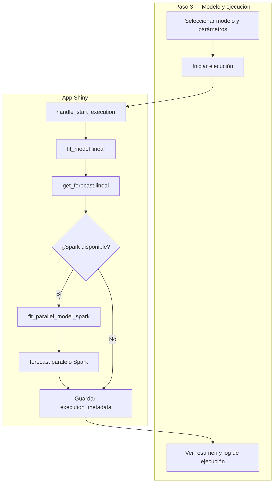
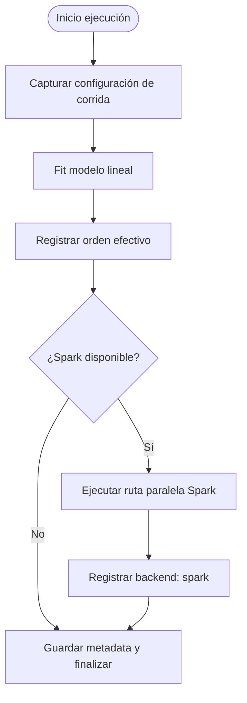

# Documentación: Modelo y ejecución

Este paso configura el modelo, ajusta el pronóstico lineal y ejecuta además la ruta paralela para AR, MA, ARMA y ARIMA usando Spark.

Importar en [diagrams.net](https://app.diagrams.net/): **Insertar → Avanzado → Mermaid**.

---

## Diagrama 1 — Flujo de ejecución del Paso 3

---

## Diagrama 2 — Trazabilidad mínima implementada

---

## Lo que ahora se muestra/guarda

- Orden efectivo del modelo ajustado.
- Backend paralelo utilizado (`spark` cuando está disponible).
- Tiempos de wall-clock del paso 3: `execution_metadata.time_linear_fit_s`, `time_parallel_fit_s`.
- Log de ejecución con hitos principales y líneas **⚠ Aviso:** por cada mensaje capturado del motor (TSLib, PySpark en driver, workers en ruta genérica AR/MA/ARMA).
- Lista `runtime_warnings` en estado y copia en `execution_metadata.runtime_warnings`.
- Metadatos de ejecución en estado reactivo (`execution_metadata`).

## Avisos del motor (no solo consola)

Los `UserWarning` de modelos (p. ej. serie no estacionaria) y avisos de Spark relevantes se **registran** y se muestran en:

- Paso 1 (validación): bloque *Avisos del motor* dentro del resultado de validar datos (`validation_report.runtime_warnings`).
- Paso 3: panel **Registro de la corrida** (`execution_log`).
- Paso 4: sección **Avisos del motor (última ejecución)**.

La ruta genérica Spark usa `groupBy.applyInPandas` (API recomendada frente al `grouped map` pandas UDF deprecado).

---

## Áreas de mejora

- Ampliar metadatos con **tiempos de forecast** lineal/paralelo además del fit (ya se guardan `time_linear_fit_s` y `time_parallel_fit_s`).
- Mostrar “por qué” del orden automático elegido por cada modelo.
- Estandarizar tabla comparativa lineal vs paralelo (error y tiempo) para todos los modelos (hoy el gráfico/tabla |L−P| está centrado en ARIMA con ambas rutas OK).
- Traducir o resumir en español avisos técnicos largos (mensajes de librerías en inglés).

## Nota sobre precisión

La UI muestra métricas de **diferencia entre pronósticos** lineal vs paralelo (p. ej. MAE |L−P|, RMSE entre vectores, escalar tipo MAPE*). Sirven para comparar **consistencia entre rutas**, no error frente a futuro real salvo que se incorpore hold-out en el asistente.

Con **ARIMA** y ambas rutas: gráfico único de pronóstico (rosa lineal, verde paralelo), tabla comparativa y barras |L−P| por horizonte en Resultados.

## Regla de estacionariedad

En la UI se bloquea AR, MA y ARMA cuando la validación reporta señal de tendencia (riesgo de no estacionariedad). En ese caso se recomienda diferenciación o usar ARIMA antes de ejecutar.

La ruta paralela cubre AR, MA, ARMA y ARIMA sobre **Spark**; el ajuste **lineal** en esta pantalla puede usar `n_jobs` dentro de TSLib, pero el **paralelismo distribuido** de la corrida comparativa es el de Spark.

## Pestaña Benchmark (ARIMA)

Fuera del asistente por pasos, la pestaña **Benchmark** compara **dos rutas** sobre series sintéticas (tiempos de ajuste) y CSV en `sampler/datasets/` (holdout):

- **ARIMA paralelo** (Spark, `ParallelARIMAWorkflow`) vs **ARIMA lineal** (statsmodels en proceso).
- Figuras: tiempos de ajuste (eje Y logarítmico para comparar órdenes de magnitud), barras RMSE/MAE/MAPE en holdout, y |error| por horizonte. Opción de rejilla `grid_mode` para el workflow paralelo (`docs/ARIMA_METODOLOGIA_ROADMAP.md`).

Ya **no** se incluyen en esa pestaña: gráfico de speedup frente a TSLib lineal, bloque ACF/PACF de benchmark, resumen textual tipo N\*, ni la sección “secuencial vs paralelo interno” (`n_jobs` del `ARIMAModel`).