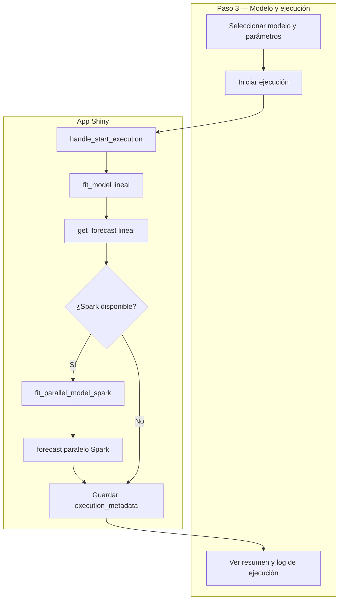

# Documentación: Modelo y ejecución

Este paso configura el modelo, ajusta el pronóstico lineal y ejecuta además la ruta paralela para AR, MA, ARMA y ARIMA usando Spark.

Importar en [diagrams.net](https://app.diagrams.net/): **Insertar → Avanzado → Mermaid**.

---

## Diagrama 1 — Flujo de ejecución del Paso 3

---

## Diagrama 2 — Trazabilidad mínima implementada

---

## Lo que ahora se muestra/guarda

- Orden efectivo del modelo ajustado.
- Backend paralelo utilizado (`spark` cuando está disponible).
- Log de ejecución con hitos principales y líneas **⚠ Aviso:** por cada mensaje capturado del motor (TSLib, PySpark en driver, workers en ruta genérica AR/MA/ARMA).
- Lista `runtime_warnings` en estado y copia en `execution_metadata.runtime_warnings`.
- Metadatos de ejecución en estado reactivo (`execution_metadata`).

## Avisos del motor (no solo consola)

Los `UserWarning` de modelos (p. ej. serie no estacionaria) y avisos de Spark relevantes se **registran** y se muestran en:

- Paso 1 (validación): bloque *Avisos del motor* dentro del resultado de validar datos (`validation_report.runtime_warnings`).
- Paso 3: panel **Registro de la corrida** (`execution_log`).
- Paso 4: sección **Avisos del motor (última ejecución)**.

La ruta genérica Spark usa `groupBy.applyInPandas` (API recomendada frente al `grouped map` pandas UDF deprecado).

---

## Áreas de mejora

- Mostrar tiempo de ejecución por fase (fit lineal, forecast, paralelo).
- Mostrar “por qué” del orden automático elegido por cada modelo.
- Estandarizar tabla comparativa lineal vs paralelo (error y tiempo) para todos los modelos.
- Traducir o resumir en español avisos técnicos largos (mensajes de librerías en inglés).

## Nota sobre precisión

La UI muestra `MAE Dif. L/P` y `RMSE Dif. L/P` como distancia entre pronóstico lineal y paralelo. Esto sirve para comparar consistencia entre rutas de ejecución.
Para medir precisión real del modelo, el siguiente paso recomendado es backtesting con conjunto holdout.

## Regla de estacionariedad

En la UI se bloquea AR, MA y ARMA cuando la validación reporta señal de tendencia (riesgo de no estacionariedad). En ese caso se recomienda diferenciación o usar ARIMA antes de ejecutar.

La ruta paralela cubre AR, MA, ARMA y ARIMA sobre Spark; no se usa paralelismo local por CPU (`n_jobs`) en esta pantalla.

## Pestaña Benchmark (ARIMA)

Fuera del asistente por pasos, la pestaña **Benchmark** incluye:

- Comparación de tiempos **secuencial vs paralelo** (`n_jobs`) para órdenes **ARIMA** distintos.
- **Benchmark triple ARIMA**: TSLib lineal, `ParallelARIMAWorkflow`, y **Spark + statsmodels** sobre series sintéticas y CSV del directorio `sampler/datasets/` (véase `sampler/README.md` en la raíz TT). Se reportan speedups y un **N\*** aproximado donde el speedup frente al lineal alcanza ≥ 1.