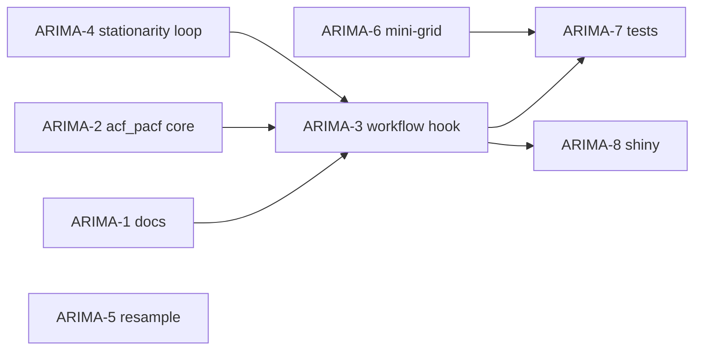

# Roadmap: alineación metodología (diagrama) ↔ `ParallelARIMAWorkflow`

Plan de trabajo para cerrar huecos entre la **Figura 5** (pasos y cajas naranjas) y la **implementación actual** en TSLib. Cada ítem puede abrirse como *issue* en GitHub/GitLab copiando título y cuerpo.

**Referencias de código**

| Componente | Ruta |
|------------|------|
| Workflow paralelo | `time-series-library/tslib/spark/parallel_arima_workflow.py` |
| Estacionariedad | `time-series-library/tslib/core/stationarity.py` (vía `StationarityAnalyzer`) |
| ACF/PACF | `time-series-library/tslib/core/acf_pacf.py` |
| ARIMA lineal (wizard) | `time-series-library/tslib/models/arima_model.py` |
| Doc diagrama vs código | `docs/series-tiempo-arima-y-paralelismo.md` §4 |

---

## Fases y orden sugerido

| Fase | Objetivo | Issues |
|------|----------|--------|
| **A — Documentación** | Congelar “qué es 100%” y trazabilidad diagrama↔código | ARIMA-1 |
| **B — Identificación** | ACF/PACF → rangos `max_p`, `max_q` | ARIMA-2, ARIMA-3 |
| **C — Estacionariedad** | Bucle explícito tipo diagrama | ARIMA-4 |
| **D — Preprocesado** | Granularidad / remuestreo | ARIMA-5 |
| **E — Ajuste local** | Mini-grid ±1 alineado al texto | ARIMA-6 |
| **F — Calidad** | Tests, Shiny opcional, benchmark | ARIMA-7, ARIMA-8 |

Ejecutar en orden **ARIMA-1 → 2 → 3 → 4 → 5 → 6 → 7 → 8** salvo que se trabaje en paralelo: **ARIMA-5** (remuestreo) puede ir en paralelo con **ARIMA-2/3** si hay dos personas.

---

## ARIMA-1 — Matriz de trazabilidad diagrama ↔ código

**Tipo:** docs  
**Esfuerzo:** bajo (0.5–1 día)

**Descripción**  
Añadir en `docs/series-tiempo-arima-y-paralelismo.md` (o subsección nueva) una tabla: cada caja del diagrama (1–14) → método o paso en `ParallelARIMAWorkflow` → “implementado / parcial / no”.

**Criterios de aceptación**

- [ ] Tabla con columnas: *Paso diagrama*, *Descripción*, *Implementación*, *Notas*.
- [ ] Referencia explícita a que el “paso 1 granularidad” no es hoy el `STEP 1` del código (que es \(d\) + transformación).
- [ ] Enlace a este roadmap.

**Dependencias:** ninguna.

---

## ARIMA-2 — Función `suggest_arima_orders_from_acf_pacf`

**Tipo:** feature / librería  
**Esfuerzo:** medio (2–4 días)

**Descripción**  
Nuevo módulo o funciones en `tslib/core/` que, dada una serie **ya alineada a la frecuencia deseada** y **diferenciada hasta estacionaria** (o usar `d` conocido), calcule ACF/PACF con `ACFCalculator`/`PACFCalculator`, detecte retardos significativos (bandas Bartlett o umbral configurable) y devuelva `max_p_suggested`, `max_q_suggested` con techos razonables (`min(k, floor(n/10))`, etc.).

**Criterios de aceptación**

- [ ] API clara: p. ej. `suggest_p_q_orders(y, d, max_lag=..., alpha=...) -> Tuple[int,int]`.
- [ ] Tests unitarios con serie sintética AR(2), MA(1), ruido blanco.
- [ ] Documentación breve en docstring (inglés).

**Dependencias:** ARIMA-1 opcional.

---

## ARIMA-3 — Integrar sugerencias ACF/PACF en `ParallelARIMAWorkflow`

**Tipo:** feature  
**Esfuerzo:** medio (2–3 días)

**Descripción**  
Tras `_determine_differencing_order` y antes de `_determine_parameter_ranges`:

1. Opción de configuración: `grid_mode: "auto_n" | "acf_pacf" | "manual"` (o similar).
2. Si `acf_pacf`: usar ARIMA-2 para fijar `max_p`, `max_q` (con mínimos/máximos de seguridad).
3. Si `auto_n`: mantener comportamiento actual basado en `n_obs`.
4. Persistir en `results_` los retardos significativos y gráficos opcionales (debug).

**Criterios de aceptación**

- [ ] Tests de integración con datos cortos/medios/largos.
- [ ] No romper API por defecto: default puede seguir siendo `auto_n` para compatibilidad.
- [ ] `verbose` muestra nuevos rangos cuando aplique.

**Dependencias:** **ARIMA-2**.

---

## ARIMA-4 — Bucle explícito de estacionariedad (ADF/KPSS + diff/log)

**Tipo:** feature  
**Esfuerzo:** medio (2–4 días)

**Descripción**  
Alinear con el **rombo “¿es estacionaria?”** del diagrama: bucle con `d_max` configurable, reaplicar log/diff según reglas documentadas, hasta pasar tests o agotar intentos. Hoy el analizador sugiere un \(d\); aquí se formaliza el ciclo y se guarda historial de intentos.

**Criterios de aceptación**

- [ ] Parámetros: `d_max`, política de log (ya existe detección por varianza).
- [ ] Resultado en `results_['step1_differencing']` incluye lista de iteraciones.
- [ ] Tests con serie integrada conocida (p. ej. random walk).

**Dependencias:** ninguna obligatoria; encaja antes o después de ARIMA-3 (recomendado **antes** de ARIMA-3 si ACF/PACF se calculan sobre la serie ya preparada).

---

## ARIMA-5 — Preprocesado: granularidad / remuestreo (diagrama paso 1)

**Tipo:** feature / preprocesado  
**Esfuerzo:** alto (5–10 días, según UI)

**Descripción**  
Paso explícito **antes** del workflow: entrada con índice temporal + frecuencia objetivo (p. ej. `1D`, `1H`), agregación (suma/media según dominio), manejo de duplicados de timestamp. Puede vivir en `tslib/preprocessing/` y opcionalmente exponerse en Shiny en “Carga / preparación”.

**Criterios de aceptación**

- [ ] Función o clase `resample_series(df, rule, agg="mean"|"sum")` con tests.
- [ ] Documentación: cuándo usar suma vs media.
- [ ] (Opcional) Paso en wizard Shiny solo si aplica al TT.

**Dependencias:** ninguna; puede desarrollarse en paralelo de ARIMA-2.

---

## ARIMA-6 — Mini-grid local ±1 (alinear con narrativa)

**Tipo:** enhancement  
**Esfuerzo:** bajo–medio (1–2 días)

**Descripción**  
Revisar `_try_local_adjustment`: además de `(p+1,q)` y `(p,q+1)`, probar `(p-1,q)` y `(p,q-1)` cuando sea válido (p,q ≥ 0, no ambos 0), y/o dos “rondas” como en la charla (primero +1 en cada dimensión, luego -1). Documentar decisión en docstring.

**Criterios de aceptación**

- [ ] Cobertura de tests para órdenes en el borde (p=0 o q=0).
- [ ] Criterio de victoria: mismo que hoy (AICc o métrica ya usada).

**Dependencias:** ninguna.

---

## ARIMA-7 — Tests de regresión y rendimiento

**Tipo:** QA  
**Esfuerzo:** medio (2–3 días)

**Descripción**  
Suite que fije comportamiento del workflow con Spark local (`local[*]`) en CI opcional: dataset pequeño, verificar órdenes finales, no excepciones, tiempos acotados.

**Criterios de aceptación**

- [ ] `pytest` marcado o job separado si Spark no está en CI.
- [ ] Snapshot ligero de `results_` keys críticas.

**Dependencias:** ARIMA-3, ARIMA-4, ARIMA-6 deseables.

---

## ARIMA-8 — Shiny / benchmark (opcional)

**Tipo:** UX  
**Esfuerzo:** bajo–medio (1–3 días)

**Descripción**  
Si el TT lo requiere: toggles para `grid_mode`, mostrar en resultados los `max_p`/`max_q` efectivos y enlace a metodología.

**Criterios de aceptación**

- [ ] No romper flujo actual del asistente.
- [ ] Textos en español coherentes con `docs/`.

**Dependencias:** ARIMA-3 mínimo.

---

## Resumen de dependencias (grafo)

---

## Estimación global (una persona a tiempo parcial)

| Escenario | Duración orientativa |
|-----------|----------------------|
| Mínimo viable (1, 2, 3, 6, 7) | ~3–4 semanas |
| Incluyendo 4 y 5 completos | ~6–10 semanas |
| + Shiny 8 | +1–2 semanas |

---

## Checklist rápido para copiar a issue tracker

- [ ] **ARIMA-1** Matriz diagrama ↔ código  
- [ ] **ARIMA-2** `suggest_arima_orders_from_acf_pacf` en core  
- [ ] **ARIMA-3** Integrar en `ParallelARIMAWorkflow` (`grid_mode`)  
- [ ] **ARIMA-4** Bucle estacionariedad explícito  
- [ ] **ARIMA-5** Remuestreo / granularidad  
- [ ] **ARIMA-6** Mini-grid ±1 en `_try_local_adjustment`  
- [ ] **ARIMA-7** Tests regresión Spark local  
- [ ] **ARIMA-8** (opcional) Shiny + toggles  

---

*Documento generado para ejecución secuencial del plan de metodología ARIMA alineada al diagrama. Comentarios en código del proyecto en inglés.*
