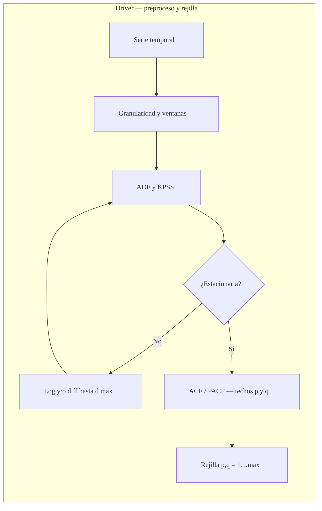
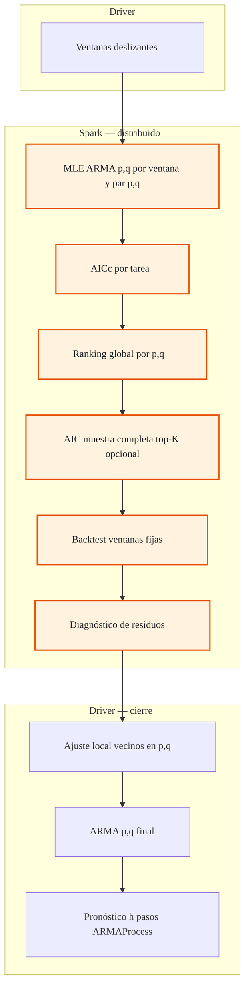

# Parallel ARMA workflow (classic ARMA(p,q))

`ParallelARMAWorkflow` in `tslib/spark/parallel_arma_workflow.py` follows the **same staged methodology** as `ParallelARIMAWorkflow`, restricted to **ARMA(p,q)** with TSLib `ARMAProcess` (MLE, **d = 0** in the model). Preprocessing (log + differencing for stationarity) matches Step 1 of `ParallelARIMAWorkflow`. The linear baseline in the Shiny app is **statsmodels** `ARIMA(p,0,q)` on the same **working** series.

## Diagramas (driver vs Spark)

**Leyenda:** **Spark** = cómputo distribuido en el cluster; **driver** = un solo proceso. Partido en dos diagramas para visores estrechos; para pantalla completa usa zoom o [mermaid.live](https://mermaid.live).

### 1 — Preparación y rejilla (driver)

### 2 — Spark (paralelo) y cierre en driver

## Steps (mapping al flujo de 11 pasos)

| # | Step | Parallel? |
|---|------|-----------|
| 1 | Log / stationarity → `working_data_`, `differencing_order_` | No |
| 2–3 | `max_p`, `max_q` (auto_n / ACF-PACF / manual) → pares **(p,q)** | No |
| 4 | Ventanas deslizantes | No |
| 5 | **Spark**: una fila por (ventana, p, q); `ARMAProcess.fit` | **Yes** |
| 6 | Selección global por **(p,q)** (rank + AICc) | No |
| 6b | Reconciliación opcional: min AIC en serie completa (top-K **(p,q)**) | No |
| 7–8 | Ventanas fijas + **Spark** backtest | **Yes** |
| 9 | **Spark** diagnósticos | **Yes** |
| 10 | Ajuste local en vecinos **(p±1,q)**, **(p,q±1)** si fallos | No |
| 11 | **ARMAProcess** final + `predict` | No |

## Lineal vs paralelo (app)

- **Paralelo**: `ParallelARMAWorkflow.predict` → `ARMAProcess` en `working_data_`.
- **Lineal**: statsmodels `ARIMA(p,0,q)` alineado con `fit_statsmodels_arma_aligned_to_parallel_arma_workflow` cuando `maxiter=0` converge.

## Notas

- La rejilla es **cartesiana** p ∈ [1,max_p], q ∈ [1,max_q]; el coste Spark crece con **windows × max_p × max_q**.
- No hay orden de integración **d** en el modelo ARMA; la diferenciación es solo preproceso (serie de trabajo estacionaria).
