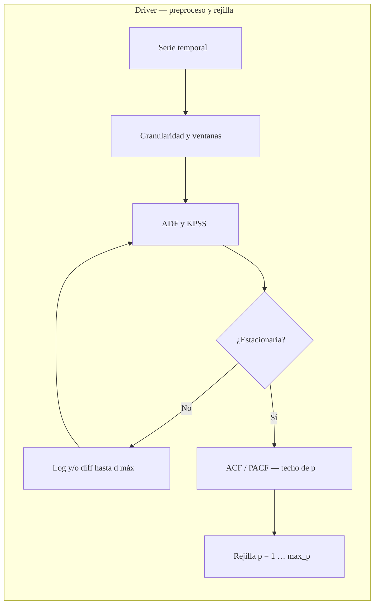
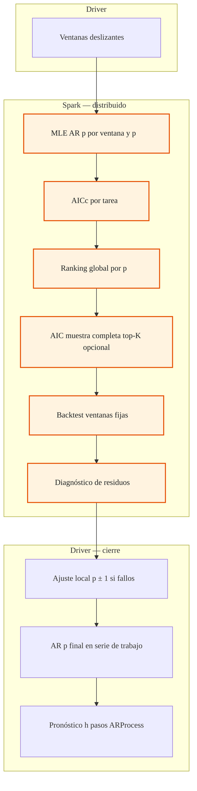

# Parallel AR workflow (classic AR(p))

`ParallelARWorkflow` in `tslib/spark/parallel_ar_workflow.py` follows the **same staged methodology** as `ParallelARIMAWorkflow`, restricted to **AR(p)** with TSLib `ARProcess` (MLE). The lineal baseline in the Shiny app is **statsmodels** `ARIMA(p,0,0)` on the same **working** series (after log / differencing for stationarity).

## Diagramas (driver vs Spark)

**Leyenda:** en los recuadros **Spark** el cómputo distribuido corre en el cluster; el resto es **driver** (un solo proceso). Los diagramas están **partidos en dos** para que no queden miniaturizados en visores estrechos (GitHub, VS Code, exportación PDF). Si necesitas verlos a pantalla completa, abre el `.md` en un visor con zoom o pega el código en [mermaid.live](https://mermaid.live).

### 1 — Preparación y rejilla (todo en driver)

`nodeSpacing` / `rankSpacing` / `padding` amplían la malla para que el gráfico no se comprima.

### 2 — Spark (paralelo) y cierre en driver

El subgrafo central agrupa los pasos que en código usan **Spark** (`mapInPandas`, jobs). El resaltado naranja funciona en visores que apliquen `classDef` (p. ej. Mermaid Live, muchos plugins de IDE).

**Lectura:** bloque **Spark** = paralelo; bloques **Driver** = un solo proceso (antes y después del tramo distribuido).

## Steps (mapping to the thesis figure)

| # | Step | Parallel? |
|---|------|-----------|
| 1 | Log / stationarity loop (ADF, KPSS) → `working_data_`, `differencing_order_` | No |
| 2–3 | `max_p` (auto_n / PACF / manual) → lista de **p** | No |
| 4 | Ventanas deslizantes | No |
| 5 | **Spark**: una fila por (ventana, p); `ARProcess.fit` | **Yes** |
| 6 | Selección global por **p** (rank + AICc agregados) | No |
| 6b | Reconciliación opcional: min AIC en serie completa (top-K **p**) | No |
| 7–8 | Ventanas fijas + **Spark** backtest MAE/RMSE/MAPE | **Yes** (backtest map) |
| 9 | **Spark** diagnósticos de residuos | **Yes** |
| 10 | Ajuste local **p±1** si diagnósticos fallan | No |
| 11 | **ARProcess** final + `predict` (no Spark) | No |

## Lineal vs paralelo (app)

- **Paralelo**: `ParallelARWorkflow.predict` → `ARProcess` en `working_data_`.
- **Lineal**: statsmodels `ARIMA(p,0,0)` con `trend` válido para `d=0`, opcionalmente alineado con `fit_statsmodels_ar_aligned_to_parallel_ar_workflow` (mismos `phi`, `c`, `sigma2` cuando `maxiter=0` converge).

## Notas

- No hay componente MA: la rejilla es solo **p**; el coste fijo de Spark es más sensible si **max_p** es pequeño.
- La serie de trabajo puede ser **diferenciada** respecto a los niveles; el modelo sigue siendo AR(p) sobre esa serie estacionaria (equivalente a enfoque Box–Jenkins sobre datos transformados).
